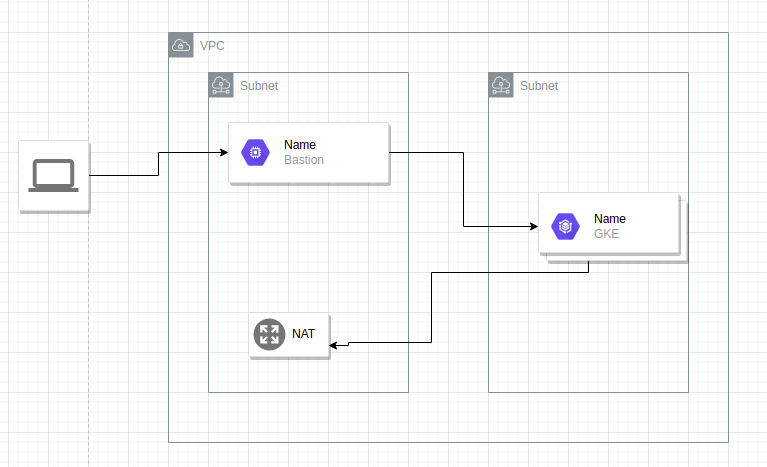

#  ITI Graduation Project

Graduation project is a fully infrastructure on google cloud platform (GCP) where we could deploy web app on it using DevOps tools like (ansible - kubernates - Docker - jenkins ).

## Infrastructure 

Using Terraform we create infrastructure modules and used it to built infrastructure that shown blow on GCP 




you can find modules at infrastructure/GCP    

## Configurations 
Using Ansible to install  dependencies and deploy jenkins on gke. 

 * **Dependencies :**
       
     1. Pip: to use python library 
     2. Kubectle: to connect to cluster api
     3. JDK-11: to use vm as a slave for Jenkins
     4. Docker: to docrize app and push it to Docker hub
     5. Kubernates library : to use k8s module in ansible 
 * **Deployment:**
     
     using k8s module
 
     1. create new namespace to deploy Jenkins pod on it 
     2. create statfulset for Jenkins
     3. create service loadbalancer to use Jenkins
    
    using command module 
     
    1. get loadbalancer ip
    2. get Jenkins admin's password

you can find playbooks in ansible/ 

## CI/CD

Using Jenkins and built pipeline 
After creating new user. add bastion as a slave for jenkins 

create a new pipeline job that listen to  [github project](https://github.com/IsmaelAtallah/jenkins)	
 throw webhook and run Jenkins file on slave

**pipeline stage** 
 * Build image: using sh command it create image from Dockerfile  and push it to dockerhub 
 * Deploy app: using kubectl it deploy new image to cluster and create loadbalancer service 

you can find jenkins script, K8s manifest and Docker file at app/

## Project demo     

https://user-images.githubusercontent.com/95479305/154840155-77d477f8-d86e-4e6f-9c34-73ed12e9d5cf.mp4

## How to use project 
* Prerequste 
  1. [Terraform](https://learn.hashicorp.com/tutorials/terraform/install-cli)
  2. [Ansible](https://docs.ansible.com/ansible/latest/installation_guide/intro_installation.html)
  3. gcloud package 
  
* clone project using:

```
   $ git init
   $ git pull https://github.com/IsmaelAtallah/graduation_project.git
```
* in infrastructure/GCP/value.tfvars Enter your project Id, credentials file path and region 

* open the terminal in infrastructure/GCP and run:
```
   $ . run.sh
```
* get loadbalancer ip and type it in browser like:
```
  http://ip:8080
```  
* get jenkins password and install suggested plugins   
* create new user
* add bastion as a slave 
* create pipeline job listen to this github project 
[https://github.com/IsmaelAtallah/jenkins](https://github.com/IsmaelAtallah/jenkins)

## Destroying 
* To destroy project open terminal and run: 
```
   $ terraform destroy -auto-approve -var-file=value.tfvars
``` 
## Contributors


|||
|:-----------------:|:-----------:
|[Omar Fandoud](https://github.com/OFandoud)|[Ismael Atallah](https://github.com/IsmaelAtallah)|
